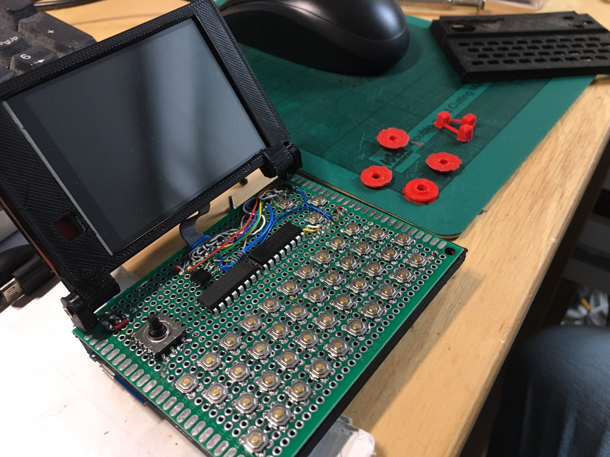
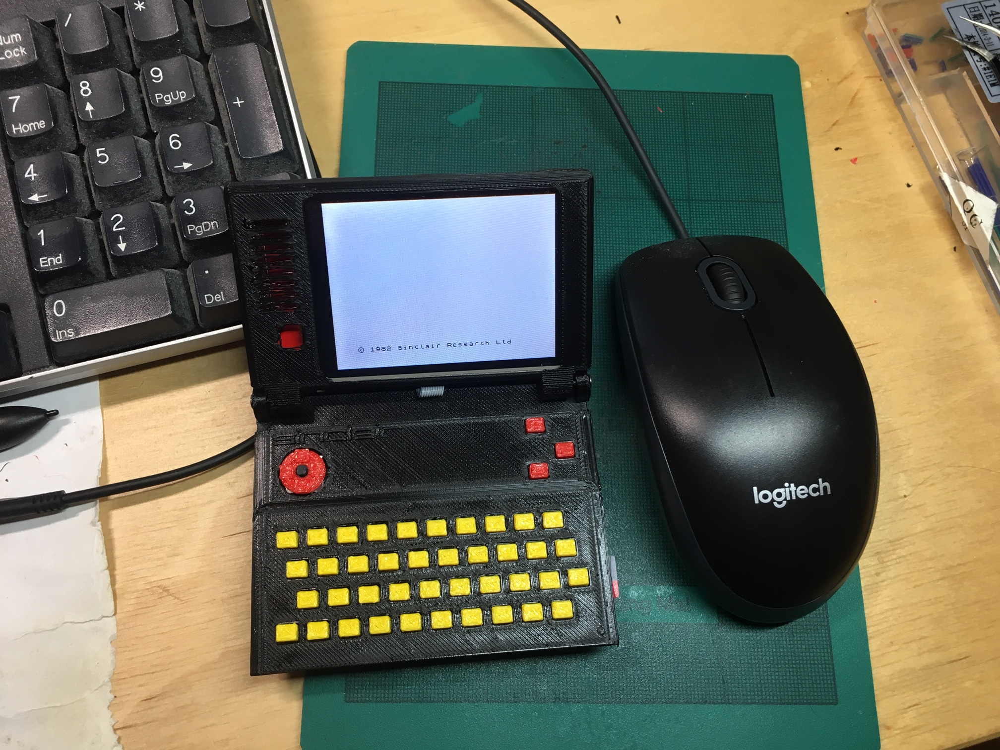
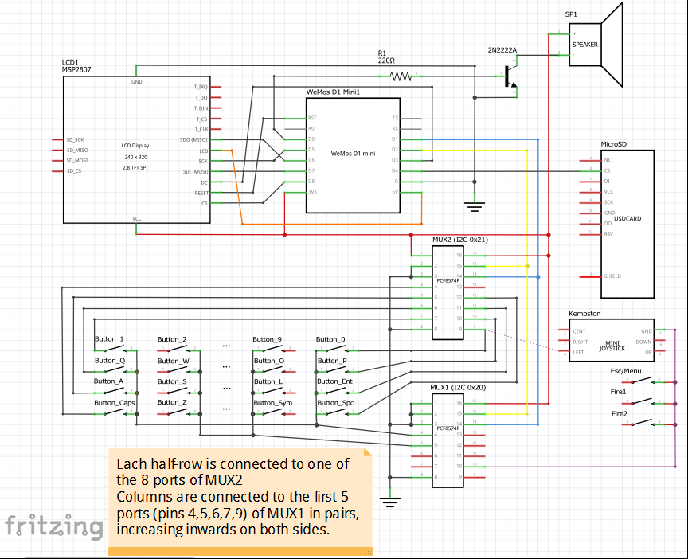

# SpecbookNano
 Teeny-tiny ESP8266 ZX Spectrum 48K laptop :)

   The source code for Denes' Wemos D1 Mini ZX Spectrum
   (As shown in https://www.facebook.com/groups/164156683632183/permalink/3351985538182599)
   
   Inspired by and based on https://github.com/aldolo69/esp8266_zxspectrum_emulator \
   
   acknowledgement of others valuable works: 
   
   Marat Fayzullin for z80 cpu emulation \
   https://fms.komkon.org/EMUL8/ \
   https://mikrocontroller.bplaced.net/wordpress/?page_id=756 \
   https://github.com/uli/Arduino_nowifi \
   https://github.com/greiman/SdFat 

\
\
Schematics: \

Compiles with the standard Arduino ESP8266 core (2.5.2). 

SPIFFS works* but disabled for now because memory is really tight and it allocates 2K.

Parts list:

1x Wemos D1 Mini\
1x ili9341 320x256 TFT display (the prototype shows a 2.8" one but there are various sizes and versions available)\
2x PCF8574P I2C multiplexers\
43x micro buttons\
1x micro joystick\
1x Wemos battery shield\
1x microSD shield or socket
1x mini speaker\
1x 2N2222A NPN transistor\
1x 220 Ohm resistor\
1x 90x70mm protoboard and a lot of tiny wires, soon to be replaced with custom PCB :)\
3D printed shell\
8x M2x6mm screws
